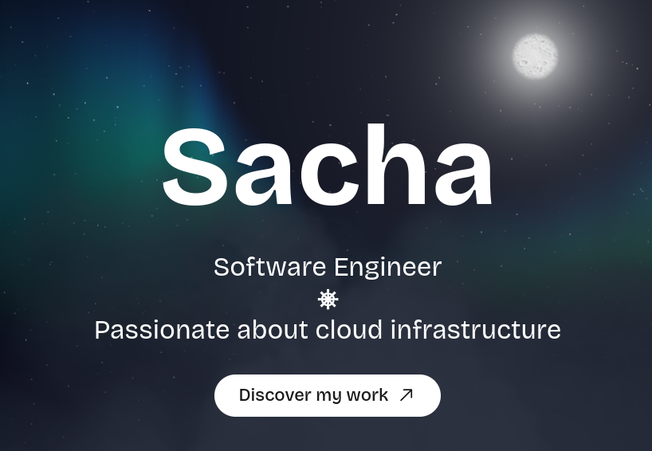

# Portfolio 2024



My [personal portfolio website](https://sachathommet.fr), built with Next.js, TypeScript and Three.js.

## Features

- Interactive 3D background using [Three.js](https://threejs.org/), a popular WebGL library.
- Pre-rendered pages with Next.js : Improves SEO and performance by building pages at build time.
  - While pages are pre-renderer, data (projects and blog posts) can be updated without rebuilding the entire website
  using [Incremental Static Regeneration](https://nextjs.org/docs/pages/building-your-application/data-fetching/incremental-static-regeneration).
  Hitting the protected `/api/revalidate` endpoint will update the data.
- Translated in English and French (`/fr` and `/en` routes).
- Toggle between dark and light mode.

## Deployment

The website is deployed on my homelab Kubernetes cluster.

### Steps:

1. Create the following Github secrets used by the CI/CD pipeline:
   - `DOCKERHUB_USERNAME`: Username to log in to the docker registry (DockerHub).
   - `DOCKERHUB_TOKEN`: Token to log in to the docker registry (DockerHub).
   - `DEV_TO_TOKEN`: Token to access the Dev.to API (used to fetch blog posts).
   It is needed for the build process because Next.js fetches the data at build time to pre-render the pages.

2. Push changes to the `main` branch:
```bash
# make changes and commit
git push origin main
```

3. It will trigger a Github Actions workflow that builds the website, containerizes it and pushes it to the docker registry.

4. Then, I update the Kubernetes deployment to use the new image. https://github.com/depp57/ops/blob/main/homelab/k8s/portfolio/base/deployment.yaml
```yaml
apiVersion: apps/v1
kind: Deployment
metadata:
  name: portfolio
spec:
  replicas: 1
  selector:
    matchLabels:
      app: portfolio
  template:
    metadata:
      labels:
        app: portfolio
    spec:
      containers:
        - name: portfolio
          image: depp57/portfolio-2024:<new_tag> # Update the image tag
          envFrom:
            - secretRef:
                name: portfolio
```

5. Finally, ArgoCD will detect the change and update the deployment.

---

The website uses also the following environment variables:
- `EMAIL_USERNAME`: Username to log in to the email server.
- `EMAIL_PASSWORD`: Password to log in to the email server.
- `NEXT_PUBLIC_IS_OPEN_TO_WORK`: Boolean to indicate if I am open to work (a message will be displayed on the website).
- `API_TOKEN`: Token to access the protected `/api/revalidate` endpoint.
- `DEV_TO_TOKEN`: Token to access the Dev.to API.

I provide them in a Kubernetes secret:

```yaml
apiVersion: v1
kind: Secret
metadata:
  name: portfolio
type: Opaque
data:
  EMAIL_USERNAME: ...
  EMAIL_PASSWORD: ...
  NEXT_PUBLIC_IS_OPEN_TO_WORK: ...
  API_TOKEN: ...
  DEV_TO_TOKEN: ...
```

## Update data

To update the data (projects and blog posts), I can mount a volume to the container in `/app/data`, with the same structure as the `data` folder in the repository.

Then, I hit the `/api/revalidate` endpoint to update the data.
